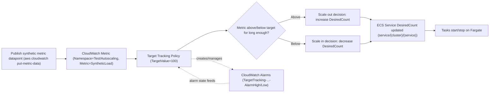
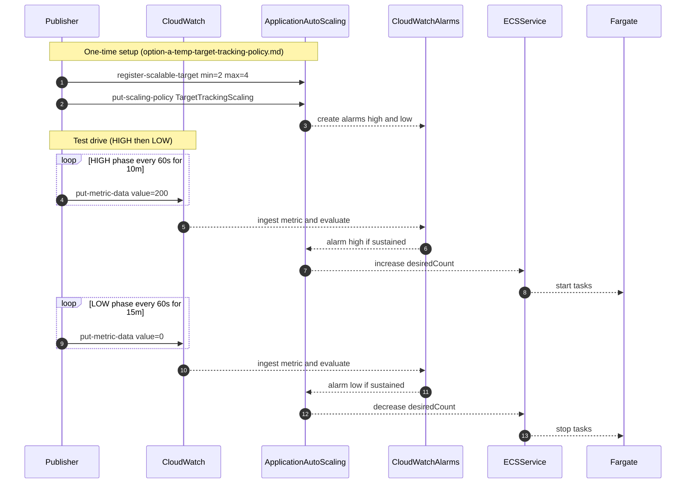

## Autoscaling workflow you just set up (Option A: Target Tracking on a custom metric)

This document describes the **end-to-end workflow** created by:

- `ecs-autoscale-testing/option-a-temp-target-tracking-policy.md` (register scalable target + create target tracking policy)
- `ecs-autoscale-testing/publish-metric-loop.sh` (publish synthetic metric HIGH then LOW)
- `ecs-autoscale-testing/proof-commands.md` (collect evidence)

The purpose is to **prove** that ECS desired count can be driven by a **custom CloudWatch metric** (not CPU/memory) in a deterministic way.

### Components involved

- **Publisher**: your shell/script running `aws cloudwatch put-metric-data` (synthetic load signal)
- **CloudWatch Metrics**: stores the time series (`Test/Autoscaling`, `SyntheticLoad`, with dimensions)
- **Application Auto Scaling**: owns ECS service autoscaling policies
- **Target Tracking Scaling Policy**: evaluates metric vs target value; creates/manages CloudWatch alarms
- **ECS Service**: applies desired count changes; starts/stops tasks
- **(Fargate capacity)**: AWS provides compute for tasks (no EC2 capacity provider needed)

### The single most important “gotcha”

Target tracking on a custom metric requires a **single time series**, which means the **dimension set in the scaling policy must match the dimension set you publish**.

In this harness, the time series is uniquely defined by these dimensions:

- `TestId = $METRIC_DIM_TEST_ID`
- `Cluster = $ECS_CLUSTER`
- `Service = $ECS_SERVICE`

If any dimension name/value differs, the policy evaluates **a different series** (often “no data”), and scaling won’t happen.

## Workflow overview (flow diagram)

## Detailed interaction (sequence diagram)

## What you should observe (proof checklist)

Use `ecs-autoscale-testing/proof-commands.md` to capture each artifact.

- **Metric exists + values changed** (CloudWatch):
  - `list-metrics` shows the metric + dimensions
  - `get-metric-statistics` shows datapoints during HIGH and LOW phases
- **Policy exists and references the right metric** (Application Auto Scaling):
  - `describe-scaling-policies` shows `CustomizedMetricSpecification` with the expected namespace/name/dimensions
- **Scaling activities show the “why”** (strongest proof):
  - `describe-scaling-activities` shows scale-out and scale-in events and their causes
- **ECS service events show desired count changes**:
  - `ecs describe-services ... events` shows messages about desired count changes and task placement
- **Target tracking alarms exist** (CloudWatch):
  - `describe-alarms --alarm-name-prefix TargetTracking-service/<cluster>/<service>`

## Where this appears in the AWS console

- **Application Auto Scaling (authoritative)**:
  - `Application Auto Scaling → Scalable targets` (namespace = ECS)
  - select `service/<cluster>/<service>` → view policies + activity
- **CloudWatch**:
  - `CloudWatch → Metrics` (namespace `Test/Autoscaling`)
  - `CloudWatch → Alarms` (TargetTracking-service/...)
- **ECS**:
  - `ECS → Clusters → <cluster> → Services → <service> → Auto Scaling` (sometimes limited vs AAS view)

## Cleanup / rollback

Deleting the policy removes the scaling behavior:

- Use the cleanup command in `proof-commands.md` (delete scaling policy)
- If you changed min/max capacity for the test, re-run `register-scalable-target` with normal bounds

